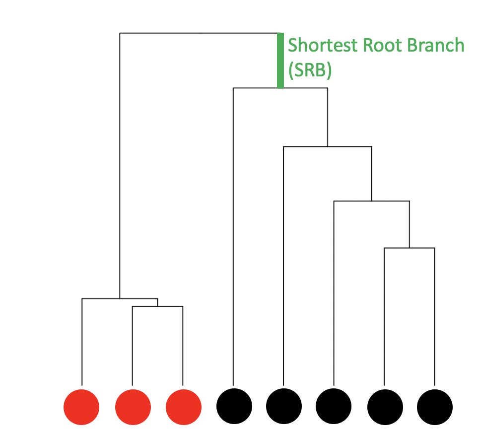

# treeXY
## Introduction
treeXY is a software tool for exploring patterns of genetic diversity between groups of taxa mapped to a common reference genome. In its simplest use case, treeXY computes a series of population genetic measures (_dXY_, _πw_, _FST_, and _D_) between all taxa in a pairwise manner. These stats are reported in window averages of a user-defined size and overlap.

The novelty of this software is in the computation of UPGMA trees based on the _dXY_ distribution at individual biallelic sites within the genome. These trees facilitate the summary of genetic distance relationships between multiple taxa simultaneously, allowing for the identification of genomic regions showing elevated divergence between groups of taxa, which may underlie genetic barriers. An advantage of _dXY_ is that, unlike _FST_, it is insensitive to changes to _πw_ following a population split. This means that it will not be confounded by population effects such as historical selective sweeps, or population bottlenecks.

To summarise _dXY_ trees, the following statistics are reported:

| Example                                         | Statistic                  | Description                                                                               |
| ----------------------------------------------- |:--------------------------:|:-----------------------------------------------------------------------------------------:|
|                | Shortest Root Branch (SRB) | The distance between the top of the tree, and the higher of the two outermost clades      |
|      | Root Division              | A numerical representation of the two outermost clades, when the tree is split at the top |

## Preparing data for analysis
The basic pipeline for preparing data for analysis is as follows:

The input for treeXY is a Popoolation2 SYNC file. This is a compact representation of the common Pileup format, which contains allele depth information across genomic regions.

## Installation
treeXY is a command line tool tested on MacOS (Ventura 13.4.1) and a Linux HPC environment (AlmaLinux 9.5). It requires Python3, along with numpy, pandas, and scipy. These dependencies have been tested using the following versions:
- `python-3.9`
- `numpy-1.23.4`
- `pandas-1.5.1`
- `scipy-1.9.3`

For the installation of specific versions of dependencies, it is recommended to use a Python dependency manager such as Poetry. Use other versions with caution.

To use treeXY, simply clone / download the contents of this repository, navigate to the containing directory, and run the command:

`python3 treeXY.py`

...with your chosen arguments. For information on the available arguments, use:

`python3 treeXY.py -h`

To test the software is working, you can carry out a quick analysis of the included *test_data.sync* input file:

`python3 treeXY.py -f test_data.sync -w 100 -o 50 --dxy_trees`

This should run in under a minute, and yield two text files:

- *test_data_15_200_2_2_100_50_treeXY.csv*, containing 100bp window averages of population genetic statistics, with 50bp overlaps
- *test_data_15_200_2_2_treeXY_topos_dXY.csv*, containing dXY SNP trees described in the Introduction

### HPC Installation
For installation on an HPC environment, a singularity image has been provided. 

## Arguments
`-f` `--file` Input SYNC file to be processed.

`-m` `--min_depth` Minimum depth, across all populations, for a site to be included. The default value is 15.

`-M` `--max_depth` Maximum depth, across all populations, for a site to be included. The default value is 200.

`-a` `--min_allele_depth` Minimum depth for an allele call. The default value is 2.

`-A` `--min_allele_pops` Minimum number of populations required for an allele call. The default value is 2.

`-w` `--window_size` Size of sliding window. The default value is 10000.

`-o` `--window_overlap` Overlap of consecutive sliding windows. The default value is 9000.

`--ignore_multiallelic` Ignore sites with >2 alleles. Normally, treeXY will process these sites by removing the least common allele.

`--write_sync` Write sites passing all treeXY depth checks to a new SYNC file.

`--dxy_trees` If specified, treeXY will run hierarchical clustering to generate _dXY_ trees at all valid biallelic sites. _dXY_ tree statistics, incuding Tree Height, Shortest Root Branch (SRB), and Root Division representation, will be written to a separate CSV file. See Introduction for more details.

`--d_trees` As above, except using Nei's _D_.

## Usage example
treeXY has been used to study barriers to gene flow between two subspecies of the snapdragon *Antirrhinum majus*, *A. m. pseudomajus* and *A. m. striatum* (Richardson *et al.*, preprint available at https://www.biorxiv.org/content/10.1101/2025.02.12.637406v1). Companions scripts for this analysis can be found in the phylogenetic_forests repository.
